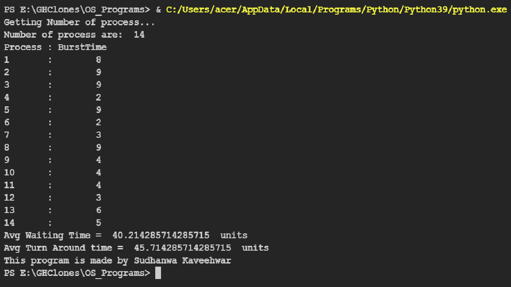
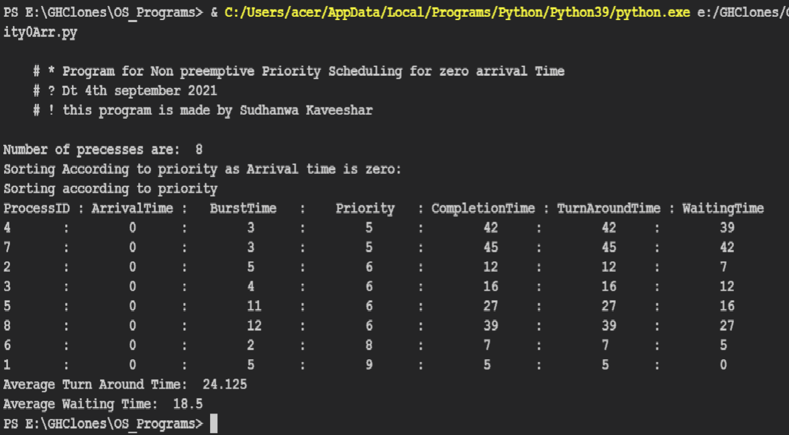
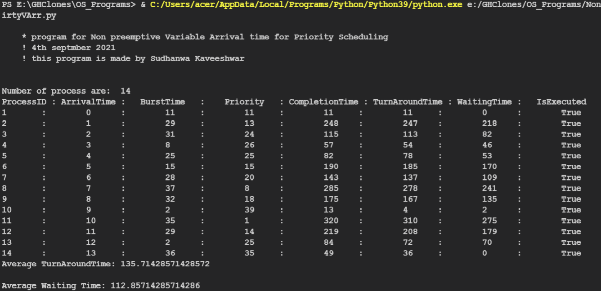

# OS_Programs

## Scheduling Algorithm

1: First Come First serve with 0 Arrival Time  
<a id ="links" href = "SchedulingAlgo/FCFS0ArrivalTime.py">Code</a>

2: First Come First serve with varying arrival time  
<a id ="links" href = "SchedulingAlgo/FCFSVArrivalTime.py">Code</a>

3: Non Preemptive priority scheduling with 0 arrival time  
<a id ="links" href = "SchedulingAlgo/NonPreEmpPriority0Arr.py">Code</a>

4: Non Preemptive priority scheduling with varying arrival time  
<a id ="links" href = "SchedulingAlgo/NonPreEmpPriorityVArr.py">Code</a>

5: Preemptive Priority Scheduling with 0 Arrival Time  

<a href="SchedulingAlgo/PreEmpPriority0Arr.py">Code </a>
