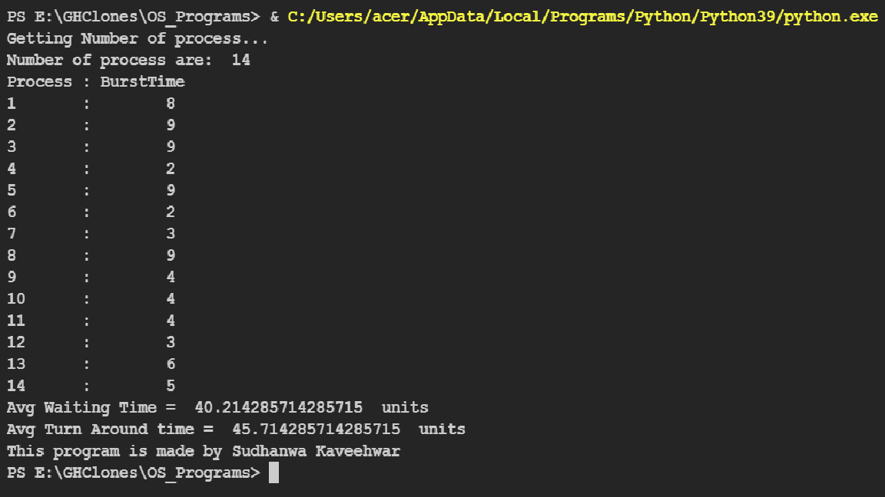
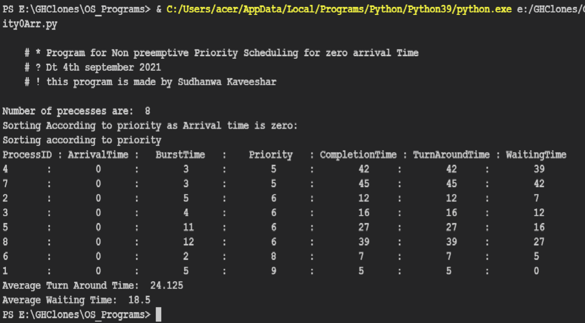
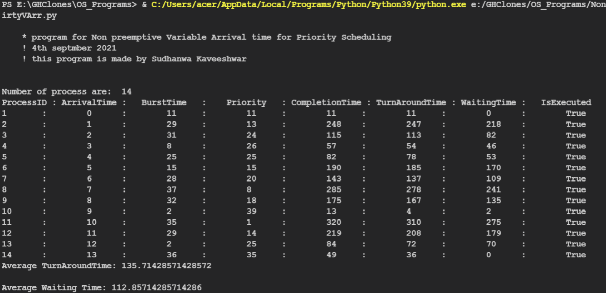

# OS_Programs

## Scheduling Algorithms

1: First Come First serve with 0 Arrival Time  
<a id ="links" href = "SchedulingAlgo/FCFS0ArrivalTime.py">Code</a>

2: First Come First serve with varying arrival time  

3: Non Preemptive priority scheduling with 0 arrival time  

4: Non Preemptive priority scheduling with varying arrival time  

